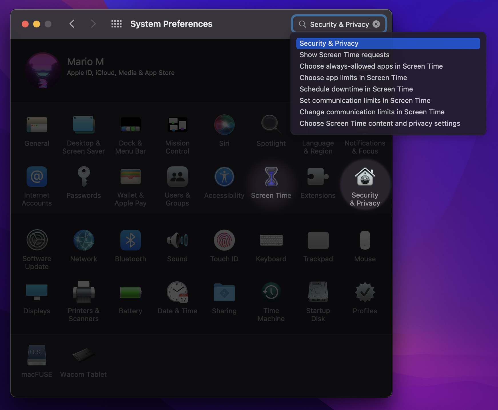
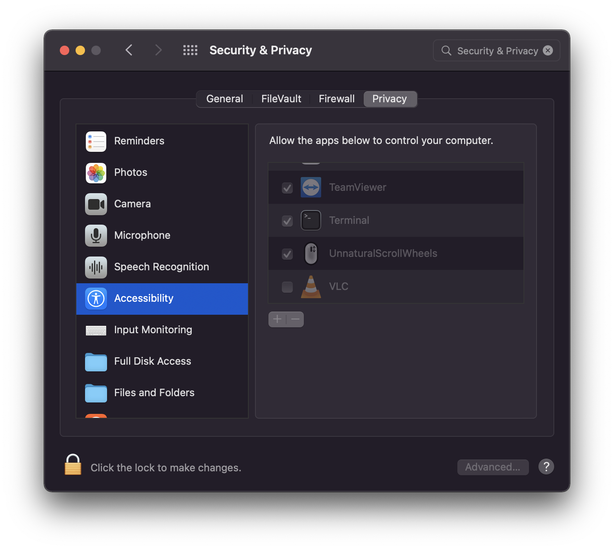
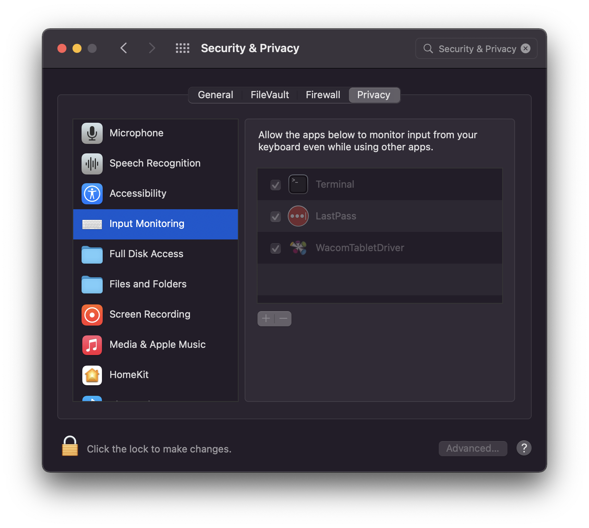

# Installation help

This document provides platform specific installation guidelines and help.

1. [All-Plaftorms](#all-platforms)
2. [Linux](#linux)
3. [MacOS](#macos)
4. [Known Issues](#known-issues)
    - [Linux Issues](#linux-issues)
    - [MacOS Issues](#macos-issues)
    - [Window Issues](#windows-issues)

## All Platforms

### Requirements

SelSearch requires Python>=3.8 to be installed.

### PIP Install

In a terminal / anaconda prompt, latest version of SelSearch can be obtained via pip:

```bash
pip install selsearch
```

Verify your installation with `selsearch -v`.

Optionally, you can generate a config file with:

```bash
selsearch init
```

### Enabling XSel

Using XSel had two major benefits over the default way:

1. it can grab selected text from a non-focused window;
2. and it does not alter the clipboard (i.e., without XSel,
SelSearch uses the clipboard to copy the selected text).

By default, Selsearch will use XSel if installed.
You can opt-out of this by editing the config file:

```toml
xsel = false  # We don't want to use XSel
```

## Linux

As most Linux distrubutions use X, it is **recommended** to install [XSel](http://www.kfish.org/software/xsel/#download).

## MacOS

As MacOS distrubutions (can) use X, it is **recommended** to install [XSel](https://formulae.brew.sh/formula/xsel).

## Known Issues

### Linux Issues

No installation issue known until now.

### MacOS Issues

*Many thanks to [mmakdis](https://github.com/mmakdis) for providing help and screenshots for the MacOS version.*

#### `This process is not trusted! [...]`

You need to allow your terminal to use your keyboard.

First, open *System Preferences*, and search for *Security & Privacy*.

<p align="center">
  
</p>

Then, in *Accessibility*, allow the *Terminal* application to control your computer.

<p align="center">
  
</p>

Repeat the same process for *Input Monitoring*.

<p align="center">
  
</p>

#### `xsel: Can't open display: (null): Inappropriate ioctl for device`

In a terminal, or in your `.bashrc` (or equivalent), write `export DISPLAY=:1`.
Verify that it works by testing the command `xsel`.

If this does fix the problem, disable XSel in the config file and open an [issue](https://github.com/jeertmans/selsearch/issues).

#### My shortcut using `<alt>` doest not work

It seems that the `<alt>` key is mapped to `<option>` on MacOS keyboards.

### Windows Issues

#### `'selsearch' is not recognized as an internal or external command [...]`

Most probably, when you installed SelSearch, a warning told you that `Path\To\Python\Scripts\` was not in `PATH`.
This means that the `selsearch` command is not directly exposed to you in the terminal.

To solve this, you must add the path to Python's scripts folder in the environment variable `PATH`. See this [tutorial](https://datatofish.com/add-python-to-windows-path/) for more details.
